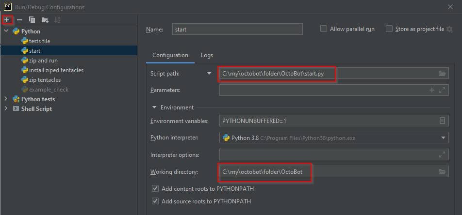
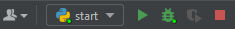

# OctoBot developer installation


This page is referring to OctoBot in versions superior to 0.4.0.


* [**Install OctoBot requirements**](octobot-developer-installation.md#install-octobot-requirements)
* [**Cloning OctoBot repositories**](octobot-developer-installation.md#cloning-octobot-repositories-with-git)
* [**Setting up PyCharm IDE**](octobot-developer-installation.md#setting-up-pycharm-ide)
* [**Setting up Visual Studio Code IDE**](octobot-developer-installation.md#setting-up-visual-studio-code-ide)

## Install OctoBot requirements

**Download and install:**

* IDE: [PyCharm](https://www.jetbrains.com/pycharm/) or [Visual Studio Code](https://code.visualstudio.com/Download)
* SCM: [Git](https://git-scm.com/downloads)
* We also use [GitKraken](https://www.gitkraken.com/git-client) to easily manage OctoBot's multiple repos, this is just a quality of life improvement and is not necessary.
* Programming language: [Python 3.10](https://www.python.org/downloads/release/python-31011/)

### Additional dependencies for Windows

* Download [Visual Studio Build Tools](https://visualstudio.microsoft.com/downloads/) and install "Desktop development with C++". It can be from 2019 or later.

.png>)

.png>)

### Additional dependencies for Mac

* install [GCC](https://discussions.apple.com/thread/8336714)

## OctoBot repositories

### Cloning OctoBot repositories with git

* open a terminal in your project folder and execute the following commands to download the repos

```bash
git clone https://github.com/Drakkar-Software/OctoBot.git --branch dev
git clone https://github.com/Drakkar-Software/OctoBot-Tentacles.git --branch dev
git clone https://github.com/Drakkar-Software/OctoBot-Trading.git
git clone https://github.com/Drakkar-Software/OctoBot-Evaluators.git
git clone https://github.com/Drakkar-Software/OctoBot-Services.git
git clone https://github.com/Drakkar-Software/OctoBot-Backtesting.git
git clone https://github.com/Drakkar-Software/OctoBot-Tentacles-Manager.git
git clone https://github.com/Drakkar-Software/OctoBot-Commons.git
git clone https://github.com/Drakkar-Software/Async-Channel.git
git clone https://github.com/Drakkar-Software/trading-backend.git
```

* now you should have all the OctoBot repos in one folder

.png>)

### Manage repositories with GitKraken

* open each folder in GitKraken

.png>)

* add your project directory (the folder where all repo folders are located)

.png>)

* now add each folder

.png>)

* Now you have all repositories open as tabs and you can switch between git repositories and branches

### Switch to experimental branches

* You can explore and switch to different branches by double-clicking on the branch name for each repository, or right click "reset to this commit".

.png>)

## Setting up PyCharm IDE

We recommend using [PyCharm](https://www.jetbrains.com/pycharm/) to navigate through the OctoBot projects. This IDE will allow you to open and navigate through the multiple OctoBot repositories and make your OctoBot run setup use the code directly from the cloned repos using the project dependencies.

* Open Pycharm and open the folder where all the OctoBot repositories are.

### Add Python interpreter

1. click on "\<No interpreter>"
2. then click on "Add Interpreter..."

.png>)

1. select "Virtualenv Environment"
2. select the location of your venv. This should be your OctoBot project folder with "/venv" at the end
3. select your base interpreter and make sure its python 3.10 or 310

.png>)

### Install Octobot dependencies

* For each OctoBot's repository: install missing dependencies in requirements.txt and dev_requirements.txt
* To install these requirements on your PyCharm virtual environment, you can either:
  * Manually go through each file listed in the commands below and install its requirements using the PyCharm requirements plugin
  * In a new terminal, activate your the virtual environment create by PyCharm (venv directory) and then run the following commands

```bash
pip install -r OctoBot/requirements.txt
pip install -r OctoBot-Backtesting/requirements.txt
pip install -r OctoBot-Commons/requirements.txt
pip install -r OctoBot-Evaluators/requirements.txt
pip install -r OctoBot-Services/requirements.txt
pip install -r OctoBot-Tentacles-Manager/requirements.txt
pip install -r OctoBot-Trading/requirements.txt
pip install -r Async-Channel/requirements.txt
pip install -r trading-backend/requirements.txt

pip install -r OctoBot-Backtesting/dev_requirements.txt
pip install -r OctoBot-Commons/dev_requirements.txt
pip install -r OctoBot-Evaluators/dev_requirements.txt
pip install -r OctoBot-Services/dev_requirements.txt
pip install -r OctoBot-Tentacles-Manager/dev_requirements.txt
pip install -r OctoBot-Trading/dev_requirements.txt
pip install -r OctoBot-Trading/dev_requirements.txt
pip install -r trading-backend/dev_requirements.txt
```


Through the requirements you have also installed OctoBot packages related to the previously downloaded repositories. You must uninstall them or your python runner will use them instead of your local code version.


* remove OctoBot pip packages to use the packages from your project directory

```
pip uninstall -y OctoBot-Backtesting OctoBot-Trading Async-Channel OctoBot-Evaluators OctoBot-Commons OctoBot-Tentacles-Manager OctoBot-Services trading-backend
```

##

### Add OctoBot modules

This will allow your PyCharm python runner to use your OctoBot repositories as source code directly. Thanks to this you will be able to edit any file in any repo and it will be taken into account in your other PyCharm run profiles runners from other open OctoBot repo. This is useful when running tests. If you skip this, you will need to install every OctoBot module with pip and won't be able to edit their code.

#### Add OctoBot modules with PyCharm Pro

*   In File/Settings/Project/Python Dependencies: For each repository: check its required OctoBot repository dependency.

    <figure><figcaption></figcaption></figure>

#### Add OctoBot modules with PyCharm Community

Go to File -> Settings and add your OctoBot module folders as a project source

###

### Create starting scripts in pyCharm

Create PyCharm run configurations using the previously created virtual env (with all the dependencies installed) for each way you want to start python commands (running OctoBot, running tests, etc).

#### Introduction to OctoBot scripts


Here we explain how to setup and run two scripts for OctoBot, but there are way more you can set up by yourself, explore the rest of the docs to find out more commands


* [**OctoBot starting script**](octobot-developer-installation.md#octobot-starting-script)
* [**Install OctoBot-Tentacles and run OctoBot script**](octobot-developer-installation.md#install-octobot-tentacles-and-run-octobot-script)

#### OctoBot starting script


this script will run OctoBot and apply all changes made to all repositories except the OctoBot-Tentacles folder (see [install OctoBot-Tentacles and run OctoBot script](octobot-developer-installation.md#install-octobot-tentacles-and-run-octobot-script))


* click on Add Configuration

.png>)

now add a new python script



### Start OctoBot in pyCharm

* You can now run and debug the whole OctoBot project and its repositories by clicking on the play button, or on the debugging button to run the debugger

<figure><figcaption></figcaption></figure>

### Install OctoBot-Tentacles and run OctoBot script in PyCharm


this script will install the OctoBot-Tentacles folder and run Octobot with all your changes applied from all repositories.


#### Create the following three scripts:

* **Script to create an installable OctoBot-Tentacles package **

.png>)

* **Script to install OctoBot-Tentacles package**

.png>)

* **Script to zip, install and run in one go**

.png>)


## Setting up Visual Studio Code IDE

### Open project folder in VS Code

Open the OctoBot Project root folder with VS Code

### Create Virtual Environment


depending your system instead of "python" you might need to use "python3.10" or "python310" . Especially if you have multiple versions of python installed it's important to use the right version


```bash
python -m venv venv  
```

### Activate virtual environment
on Windows:
```bash
.\venv\Scripts\activate
```

on Debian/Ubuntu:
```bash
source venv/bin/activate
```

### Create VSCode launch.json

.png)


The VS Code launch config is located in project-folder/.vscode/launch.json


```json
{
    "version": "0.2.0",
    "configurations": [

        {
            "name": "Start OctoBot",
            "type": "python",
            "request": "launch",
            "env": {
                "PYTHONPATH": "${workspaceFolder}/Async-Channel;${workspaceFolder}/OctoBot-Tentacles-Manager;${workspaceFolder}/OctoBot-Commons;${workspaceFolder}/OctoBot-Trading;${workspaceFolder}/OctoBot-Backtesting;${workspaceFolder}/OctoBot-Evaluators;${workspaceFolder}/OctoBot-Services"
            },
            "program": "start.py",
            "console": "integratedTerminal",
            "cwd": "${workspaceFolder}/OctoBot",
            "args": [""],
            "justMyCode": true
        }
    ]
}

```

### Create VSCode settings.json


The VS Code settings.json is located in project-folder/.vscode/settings.json


```json
{
    "python.analysis.extraPaths": [
        "./OctoBot",
        "./Async-Channel",
        "./OctoBot-Backtesting",
        "./OctoBot-Commons",
        "./OctoBot-Services",
        "./OctoBot-Evaluators",
        "./OctoBot-Trading",
        "./OctoBot-Tentacles-Manager",
    ]
}

```

### Install Octobot dependencies

* For each OctoBot's repository: install missing dependencies in requirements.txt and dev_requirements.txt

<pre class="language-bash"><code class="lang-bash">
pip install -r OctoBot/requirements.txt
pip install -r OctoBot-Backtesting/requirements.txt
pip install -r OctoBot-Commons/requirements.txt
pip install -r OctoBot-Evaluators/requirements.txt
pip install -r OctoBot-Services/requirements.txt
pip install -r OctoBot-Tentacles-Manager/requirements.txt
pip install -r OctoBot-Trading/requirements.txt
pip install -r Async-Channel/requirements.txt

pip install -r OctoBot-Backtesting/dev_requirements.txt
pip install -r OctoBot-Commons/dev_requirements.txt
pip install -r OctoBot-Evaluators/dev_requirements.txt
pip install -r OctoBot-Services/dev_requirements.txt
pip install -r OctoBot-Tentacles-Manager/dev_requirements.txt
pip install -r OctoBot-Trading/dev_requirements.txt
pip install -r OctoBot/dev_requirements.txt
</code></pre>


Through the requirements you have also installed OctoBot packages related to the previously downloaded repositories. You must uninstall them or your python runner will use them instead of your local code version.


* remove OctoBot pip packages to use the packages from your project directory

```
pip uninstall -y OctoBot-Backtesting OctoBot-Trading Async-Channel OctoBot-Evaluators OctoBot-Commons OctoBot-Tentacles-Manager OctoBot-Services
```

### Start using Visual Studio Code


Press F5 on your keybord to start OctoBot

